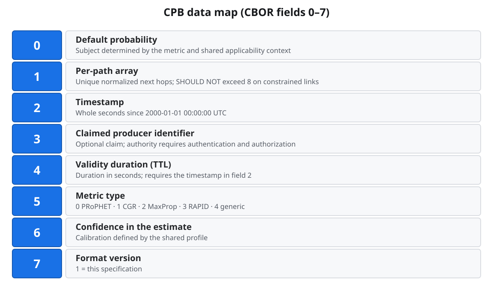

# Contact Probability Block (CPB) — Quick Reference

Short visual introduction to the unsubmitted CPB working draft
(*Probabilistic Contact Metadata for DTN Bundle Routing*): problem, wire
format, lifecycle, experimental plan, and security defaults.

See [`draft-perry-dtn-cpb.xml`](../draft-perry-dtn-cpb.xml). Pre-submission
review copy (not on the IETF Internet-Drafts repository).

---

## 1. The problem in one sentence

DTN contacts are often **uncertain**, but BPv7 endpoint IDs must stay
**immutable** — so probability must not be stuffed into the destination URI.

### Why not `ipn:100.1?prob=0.75`?

Routers that rewrite EIDs to carry metadata break integrity, security
bindings, and the BPv7 model. CPB puts probability in an **extension block**
instead.

---

## 2. What CPB is

CPB is a **BPv7 extension block** that carries *in-bundle* probability /
confidence metadata between nodes. It is a **transport for estimates**, not
a replacement for CGR, PRoPHET, MaxProp, or similar protocols.

Those protocols can **produce or consume** CPB data while keeping their own
algorithms. CPB is only the **in-bundle scalar** ([0,1] plus metric-type).
Encounter tables, contact plans, summary vectors, Spray copy-count **L**,
and MaxProp hop-lists stay in each protocol’s control plane (draft §5).

- Open questions (noise, adversaries, multi-domain trust, production interop)
  are listed in the draft and not claimed solved.
- Examples use block type **200 (0xC8)**; IANA assigns the permanent code.
  Implementations **must not** hardcode `0xC8`.

---

## 3. What’s inside a CPB (fields 0–7)

The block-type-specific data is a **CBOR map**:

| Key | Meaning |
|-----|---------|
| 0 | Default probability, with the subject defined by its metric and applicability context |
| 1 | Per-path `[next-hop, probability]` list with unique normalized next hops (senders **SHOULD NOT** exceed 8 on constrained links) |
| 2 | Timestamp in whole seconds since 2000-01-01 00:00:00 UTC |
| 3 | Claimed producer identifier (optional); authentication and authorization establish its authority |
| 4 | Validity duration in seconds (TTL); requires field 2 |
| 5 | Metric type (0 PRoPHET · 1 CGR · 2 MaxProp · 3 RAPID · 4 generic) |
| 6 | Confidence in the estimate, calibrated by the shared profile |
| 7 | Format version (1 = this specification) |

**Important rule:** do **not** mix metric types in arithmetic (e.g. do not
average a PRoPHET DP with a CGR confidence).

The same metric type also requires compatible applicability and normalization
profiles before numerical comparison. For metric 1, shared context identifies
the transmitting node, next hop, direction, and contact window or aggregate.
For metric 0, field 0 describes the producer's predictability and cannot supply
missing evidence about an arbitrary next hop. IPN next hops use the packed
64-bit FQNN; other schemes use full EID text.

---

## 4. Lifecycle at a router

1. **Create or receive** a bundle that may carry one or more CPBs.
2. **Check** format, age, applicability, and trust/BIB policy before consuming
   default or per-path probabilities. Select a whole CPB within each compatible
   metric/context/profile group using the draft's precedence rules.
3. **Decide** next hop using your routing policy.
4. **Optionally update** a nonfragment bundle with fresher local estimates,
   using the draft's append-only or authorized strip-and-replace model.
   Protected fragment CPBs retain their authenticated bytes; when they cannot
   be authenticated before reassembly, routing falls back to local state.
5. **Forward**; a node that does not understand CPB discards that block and
   continues bundle processing under BPv7 rules.

---

## 5. Planned experiments

The draft proposes future evaluation of routing behavior, estimate quality,
feedback stability, interoperability, and security processing. Comparisons
will use matched baselines and documented scenarios, metrics, and methods.

These experiments have not been performed for this draft. No experimental
results or demonstrated performance improvement are claimed. Development
check commands are documented in the repository README.

---

## 6. Security (draft §8)

Threats include false probabilities (sinkhole / blackhole), stale CPBs,
semi-trusted relays biasing routes, and inter-domain trust gaps.

- Prefer **BPSec BIB** authentication on CPBs used for routing. Authenticated
  use requires binding the CPB to its bundle and authorizing the credential
  to assert the producer identity. HMAC protection uses effective scope **7**.
- **Do not** encrypt CPB with BCB if intermediates must read it to route.
- Unauthorized or unverifiable CPBs: prefer **strict** handling (ignore the
  estimate for routing and use local state). Core BP/BPSec validation and
  security policy still govern the bundle's processing outcome.
- Multi-CPB precedence applies **after** trust verification.
- Do not add a new BIB to a fragment. Primary-bound CPBs may need reassembly
  before authentication can succeed.

---

## 7. Recap

**Why is probability not allowed in the destination EID?**
BPv7 EIDs must stay immutable. Stuffing `?prob=…` into the URI invites
rewrites that break integrity bindings and the endpoint model. Put estimates
in an extension block instead.

**Name three CPB map fields and what they mean.**
Examples: **0** default probability; **1** per-path `[next-hop, probability]`
list; **5** metric-type (which semantic family the scalar belongs to). Also
common: **2** timestamp, **4** validity TTL, **7** format version.

**What does metric-type forbid between families?**
Cross-metric arithmetic — e.g. averaging a PRoPHET delivery predictability
with a CGR confidence. Consume only matching metric-types (draft §3.5).

**What is still open?**
Noisy or adversarial estimates, multi-domain trust, partial deployment
quality, and production-stack interoperability.
