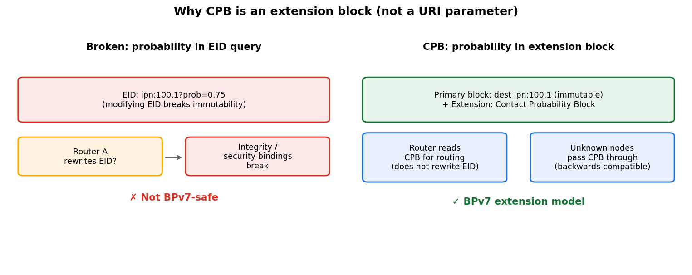
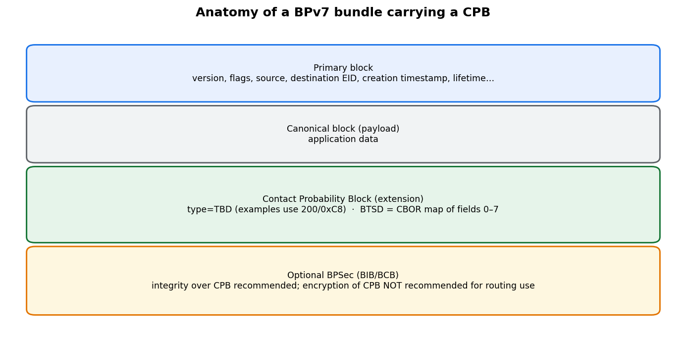
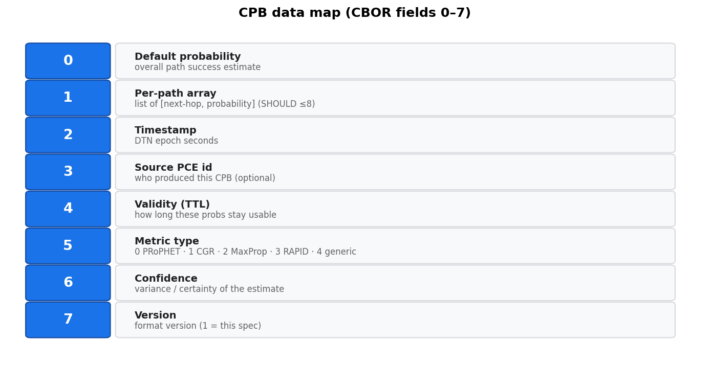
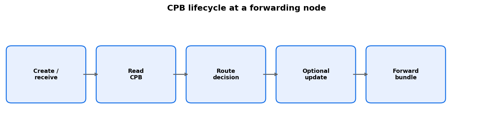
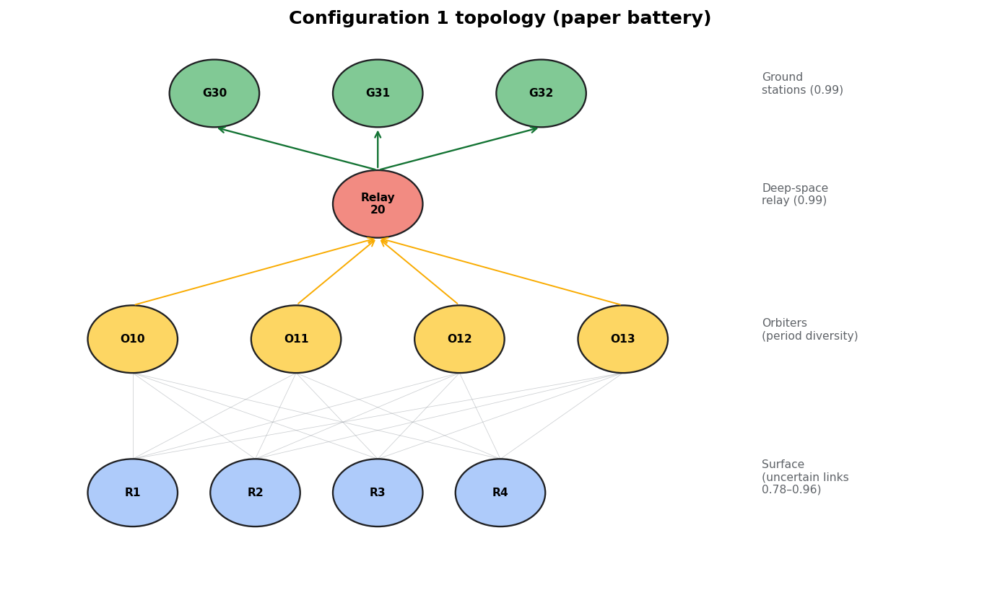
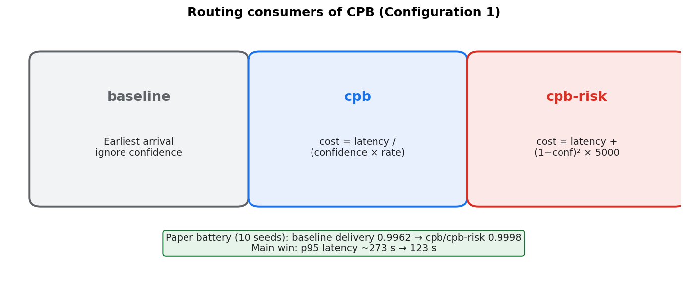
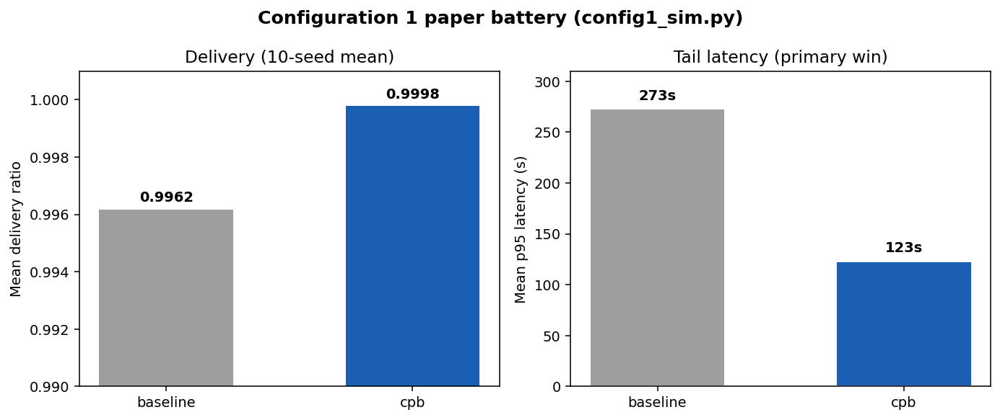

# Contact Probability Block (CPB) — Quick Teaching Guide

A short visual intro to [draft-perry-dtn-cpb-00](../draft-perry-dtn-cpb.xml)
(*Probabilistic Contact Metadata for DTN Bundle Routing*).

**Audience:** people who know BPv7 basics and want the “why / what / how” in
fifteen minutes.  
**Source of truth:** the Internet-Draft on `main`; this guide is non-normative.

---

## 1. The problem in one sentence

DTN contacts are often **uncertain**, but BPv7 endpoint IDs must stay
**immutable** — so you cannot safely stuff probability into the destination
URI.

### Why not `ipn:100.1?prob=0.75`?



Routers that rewrite EIDs to carry metadata break integrity, security
bindings, and the BPv7 model. CPB puts probability in an **extension block**
instead.

---

## 2. What CPB is

CPB is a **BPv7 extension block** that carries *in-bundle* probability /
confidence metadata between nodes. It is a **transport for estimates**, not
a replacement for CGR, PRoPHET, MaxProp, etc.

Those protocols can **produce or consume** CPB data; they keep their own
algorithms. CPB is only the **in-bundle scalar** ([0,1] + metric-type).
Encounter RIBs, contact plans, summary vectors, Spray copy-count **L**,
and MaxProp hop-lists stay in each protocol’s control plane (draft §5).



- **Experimental** status: open questions (noise, adversaries, multi-domain
  trust, production interop) are listed in the draft and not claimed solved.
- **Examples** use block type **200 (0xC8)**; IANA will assign the real code.
  Implementations **must not** hardcode `0xC8`.

---

## 3. What’s inside a CPB (fields 0–7)

The block-type-specific data is a **CBOR map**:



| Key | Meaning |
|-----|---------|
| 0 | Default probability |
| 1 | Per-path `[next-hop, probability]` list (senders **SHOULD NOT** exceed 8 on constrained links) |
| 2 | Timestamp (DTN epoch) |
| 3 | Source PCE identifier (optional) |
| 4 | Validity duration (TTL) |
| 5 | Metric type (0 PRoPHET · 1 CGR · 2 MaxProp · 3 RAPID · 4 generic) |
| 6 | Confidence / variance of the estimate |
| 7 | Format version (1 = this spec) |

**Important rule:** do **not** mix metric types in arithmetic (e.g. do not
average a PRoPHET DP with a CGR confidence).

---

## 4. Lifecycle at a router



1. **Create or receive** a bundle that may carry one or more CPBs.  
2. **Read** default / per-path probabilities (after trust/BIB policy).  
3. **Decide** next hop using your routing policy.  
4. **Optionally update** with fresher local estimates (append or
   strip-and-replace — see security section of the draft).  
5. **Forward**; nodes that do not understand CPB pass the block through.

---

## 5. Configuration 1 experiment (what the public sim measures)

The shipped simulator `impl/config1_sim.py` uses **Configuration 1**:



- 4 rovers → 4 orbiters → 1 relay → 3 grounds  
- First-hop success probabilities in **[0.78, 0.96]**  
- Space-side hops ~**0.99**  
- Paper battery: **10 seeds**, ~**80k** bundles per arm per seed  

### Routing policies (names match draft §12)



| Label | Cost / rule |
|-------|-------------|
| **baseline** | Earliest predicted arrival (ignore confidence) |
| **cpb** | `latency / (confidence × bottleneck_rate)` |

### Headline results (paper battery)



| Policy | Mean delivery | Mean p95 latency |
|--------|---------------|------------------|
| baseline | **0.9962** | ~**273 s** |
| cpb | **0.9998** | **123 s** |

**Two experiment parts (draft §12.1):** (1) wire format + ION data-plane
survival of the extension block; (2) routing value of confidences of the
class CPB carries (simulator; bridge tests prove encode/decode preserves
the cost ranking).

Reproduce:

```sh
cd impl
python3 test_cpb.py
python3 test_config1_policies.py   # pins the §12 cost formula
python3 test_sim_cpb_bridge.py     # Config1 confidences ↔ CPB wire
python3 config1_sim.py --battery paper --strategy both
```

---

## 6. Security in one slide (read §8 of the draft)

Threats include false probabilities (sinkhole / blackhole), stale CPBs,
semi-trusted relays biasing routes, and inter-domain trust gaps.

Defaults to remember:

- Prefer **BPSec BIB** integrity on CPBs used for routing.  
- **Do not** encrypt CPB with BCB if intermediates must *read* it to route.  
- Unauthorized or unverifiable CPBs: prefer **strict** (ignore for routing,
  still forward) over laundering signatures.  
- Multi-CPB precedence applies **after** trust verification.

---

## 7. How to read the full draft

| Sections | Content |
|----------|---------|
| §1–2 | Problem + why extension blocks |
| §3–4 | Wire format + operational semantics |
| §5–7 | Protocol fit, backwards compat, ops |
| §8–9 | Security + IANA |
| §10–11 | Overhead + implementation status |
| §12 | Experiment (Config 1 + real ION notes) |
| §13 | How to run the reference code |

---

## 8. Teaching checklist (10-minute quiz)

1. Why is probability **not** allowed in the destination EID?  
2. Name three CPB map fields and what they mean.  
3. What does metric-type **forbid** between families?  
4. Write the **cpb** cost formula used in the experiment.  
5. What is the main Config 1 win: delivery points or **tail latency**?  
6. What remains open (noise, adversaries, multi-domain, production stacks)?

---

*Non-normative teaching aid. For normative language, use the Internet-Draft.*
